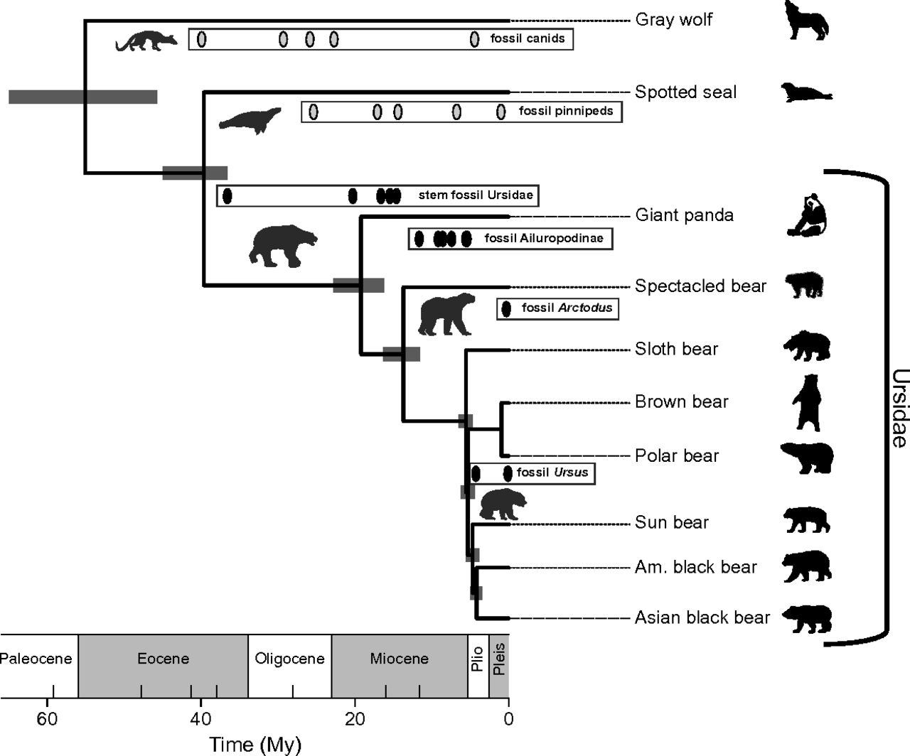
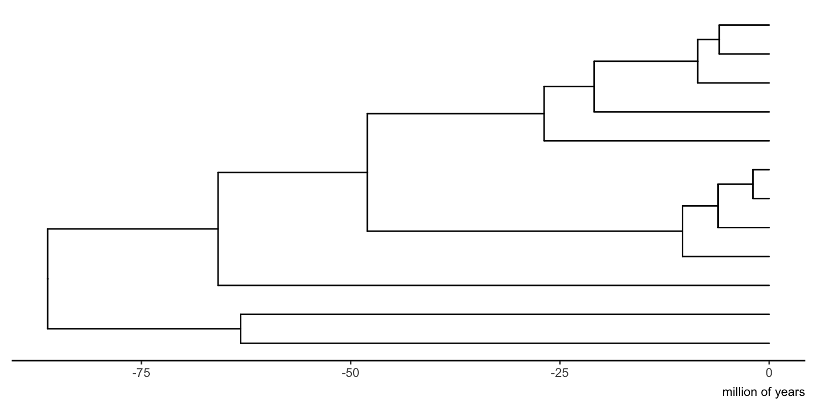
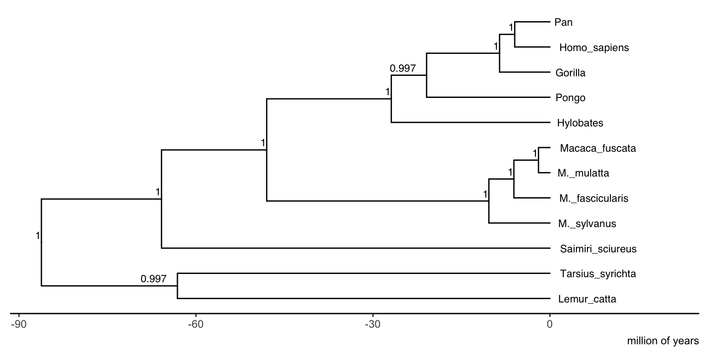
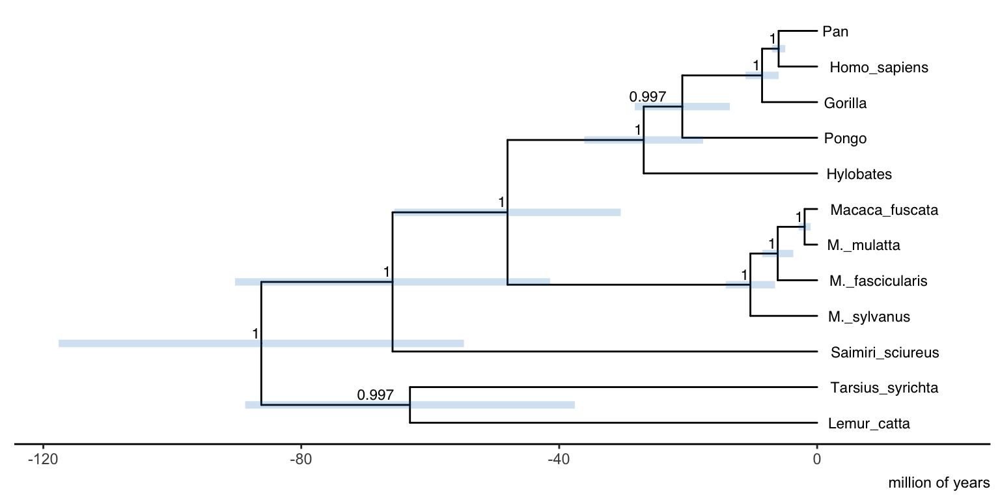
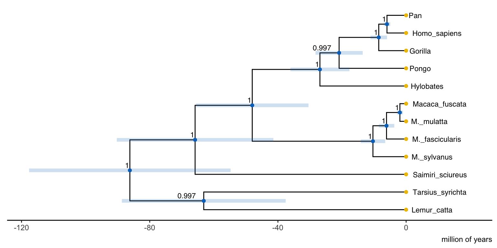
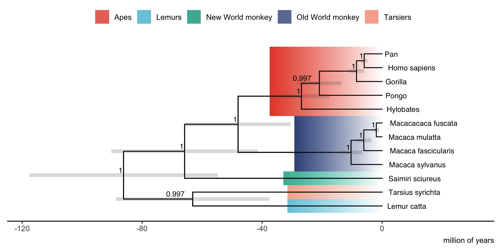
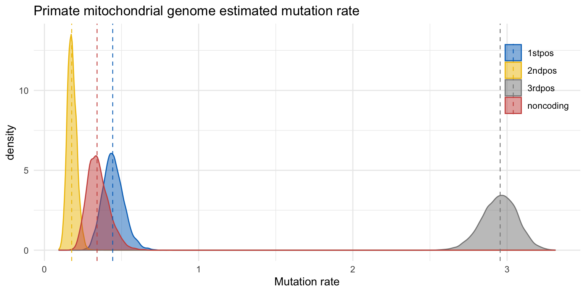
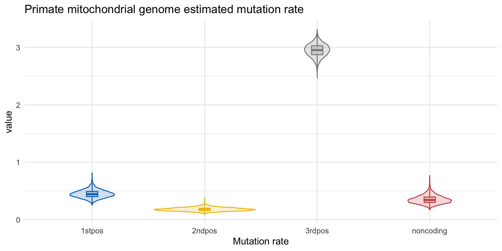
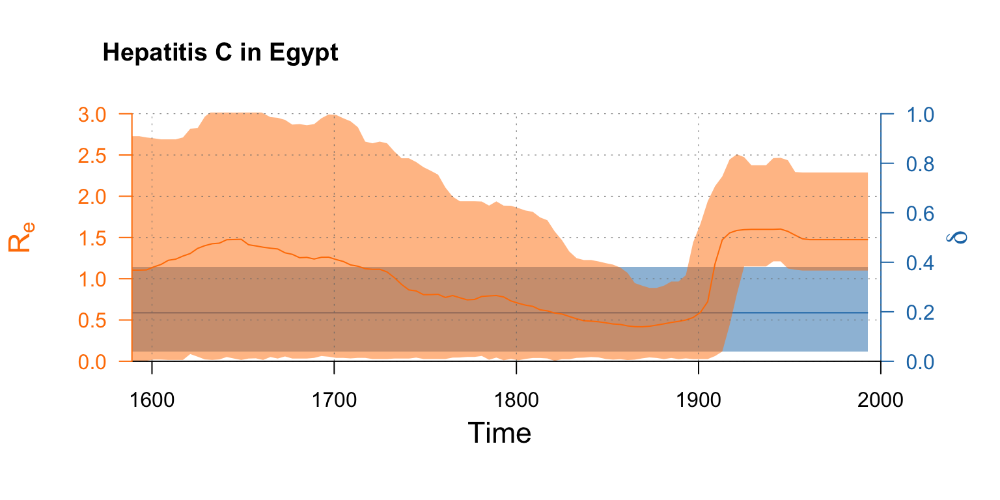
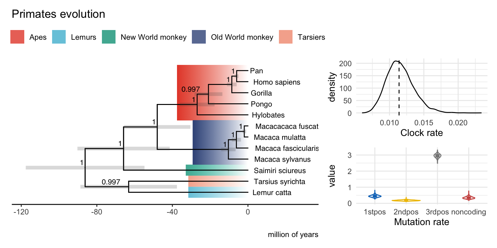

# Background

Analyzing and interpreting the extensive output generated in Bayesian phylodynamic analyses can sometimes be a challenging task. This tutorial aims to provide insights into scientific figure design techniques and resources in R that can effectively visualize BEAST2 results.

By employing appropriate visualizations, we can enhance our understanding of the evolutionary processes and facilitate the effective communication of findings.

In most BEAST2 analyses, the results consist of two files: the posterior sample of phylogenetic trees (.trees file) and the parameters (.log file). These are long files containing MCMC samples and we will need to summarise them to be able to understand the results.

----

# Programs used in this Exercise 

### BEAST2 - Bayesian Evolutionary Analysis Sampling Trees 2

BEAST2 (http://www.beast2.org) is a free software package for Bayesian evolutionary analysis of molecular sequences using MCMC and strictly oriented toward inference using rooted, time-measured phylogenetic trees. This tutorial assumes that the files came from analyses using the BEAST2 version v{{ page.beastversion }} .

### R and RStudio
R ([https://www.r-project.org](https://www.r-project.org)) is a programming language and software environment designed for statistical computing, data analysis, and graphical visualization. It is widely used in bioinformatics, data science, and statistical modeling due to its extensive package ecosystem and flexibility.

RStudio ([https://www.rstudio.com](https://www.rstudio.com)) is an integrated development environment (IDE) for R that provides a user-friendly interface to write, run, and debug R code. It simplifies data analysis workflows by offering features like script editors, project management, and built-in plotting tools. It is optional but will provide better user experience.

We will install R packages for data processing and visualisation along the way.

----

# Motivation and Tips for BEAST2 results visualization

When generating scientific figures based on abundant Bayesian MCMC results, there are several important considerations to keep in mind.
- **Display Uncertainty**: Bayesian analysis provides posterior distributions that capture the uncertainty of parameter estimates, including tree topology, branch lengths, and evolutionary rates. Displaying this uncertainty is important for robust interpretation. This can be done by showing the 95% HPD interval around key parameters, like node heights with error bars, or visualizations such as boxplots or density plots for the posterior probability of the parameters. Avoid presenting point estimates without any indication of the associated uncertainty.

<figure align="center">
	<a id="Fig1"></a>
	
	<figcaption>Figure 1: Divergence times of extant bears estimated under the FBD model in BEAST2. Grey horizontal bars show their uncertainty inytervals.  </figcaption>
</figure>
<br>


- **Clarity of Tree Representations**: Trees are complex objects depicting numerous relationships between samples. Extracting valuable insights from trees heavily relies on a clear representation. Avoid cluttering the tree with too many branches or overlapping labels. Use annotations to highlight key clades or important nodes in the tree. Don’t forget to include the scale or axis in your tree.
- **Tell a story**: With the abundance of information in BEAST2 results, it is important to have a clear objective for the main result you wish to communicate. Otherwise, the figure may become excessively complex and lose its meaning. Utilize color, shape, and size variations to emphasize significant patterns. Incorporate the temporal and geographical information present in the parameters, such as utilizing skyline plots or geographical maps instead of visualizing individual parameters. Prior to plotting, summarize or transform the results if needed.

<figure align="center">
	<a id="Fig2"></a>
	
	<figcaption>Figure 2: Tell a story: [Nextrain](https://nextstrain.org) provides interactive visualization of pathogen genome data </figcaption>
</figure>
<br>

- **Experiment**. There is not just one way of visualizing a set of results, so do not be afraid of experimenting with different type of plots. Interactive visualization tools can also be useful to interpret and communicate complex data. These tools enable exploration and manipulation of the results in real time, so they will work well for online and interactive presentations (but not for in a PDF document).

Remember, figures should be self-explanatory and provide sufficient context to be understood. Seek feedback from colleagues or mentors to improve the clarity and effectiveness of your figures.

Next, you will find a few code snippets with examples to visualize the most common type of plots from BEAST2 results. It is not an extensive tutorial (you can find a lot of good resources on that at the end of each section). We assume that you have a working knowledge of R and ggplot.

# How to visualize BEAST2 summary tree in R with ggtree

To visualize trees there are multiple tools and packages available: [FigTree](http://beast.community/figtree), [Densitree](https://www.cs.auckland.ac.nz/~remco/DensiTree/DensiTree.html), [IcyTree](https://bioconductor.org/packages/release/bioc/html/ggtree.htmltidytreeicytree.org), R packages: [ggtree](https://bioconductor.org/packages/release/bioc/html/ggtree.htmltidytree), [phytools](https://cran.r-project.org/web/packages/phytools/index.html), [ape](https://cran.r-project.org/web/packages/ape/index.html), python packages: [Biopython Phylo](https://biopython.org/wiki/Phylo), [ETE toolkits](http://etetoolkit.org/) and many more. 
**IcyTree** is great for quick visualization and exploration of trees. For publication-ready figures, you can use **FigTree** and **ggtree** or other R and python packages. **Densitree** is a program for qualitative analysis of set of trees. In this tutorial we will focus in R and the ggtree package.

### 1. Install and load the required packages

The R code below will install the metapackage `treedataverse`   that includes several useful packages for processing and visualizing trees in R: `treeio` , `ggtree` , `ggtreeExtra`  and `tidytree` . We will also use library `ggsci` which has nice color palettes .

```{r}
	# Install packages
	install.packages("BiocManager")
	install.packages("ggsci")
	BiocManager::install("YuLab-SMU/treedataverse")

	# Load packages
	library(treedataverse)
	library(ggsci)
```

### 2. Read the BEAST summary tree and metadata 

In general, we will visualize a summary tree from the posterior samples of trees, e.g. we can create a Maximum Clade Credibility (MCC) tree with TreeAnnotator.

```{r}
	tree_file <- "https://github.com/Taming-the-BEAST/Visualizing-BEAST2-results/raw/refs/heads/main/precooked_runs/Primates.MCC.tree" 
	tree <- read.beast(tree_file)
```

### 3. Plot the tree with backward in time axis

```{r}
	p <- ggtree(tree,  mrsd = NULL) + 
  		theme_tree2() + # This ggtree theme will add a forward in time x-axis
  		labs(caption="million of years")
	p <- revts(p) # This will reverse the time in the axis 
	p
```

<figure align="center">
	<a id="Fig3"></a>
	
	<figcaption>Figure 3: Tree with backward in time axis. </figcaption>
</figure>
<br>


Usually, with epidemiological datasets, you will want a forward in time x-axis in calendar time. In this case, use `theme_tree2()` and the parameter `mrsd` in the in `ggtree()` function equal to the most recent sample date.

### 4. Customize tree labels

```{r}
	p1 <- p +
  		geom_tiplab(size = 3, hjust = -0.1) + # add the tip labels
  		geom_nodelab(aes(label = round(posterior, 3)), 
               		hjust = 1.5, vjust = -0.5, size = 3) + # add posterior value to internal nodes
  		xlim_tree(20) # adjust x axis to show full tip names

	p1
```

<figure align="center">
	<a id="Fig4"></a>
	
	<figcaption>Figure 4: Tree with custom labels. </figcaption>
</figure>
<br>

### 5. Add error bars

```{r}
	p1 <- p1 +
  		geom_range(range = 'height_0.95_HPD',
             	color = pal_jco("default")(1), alpha = 0.2, size = 2) 
	p1
```
<figure align="center">
	<a id="Fig5"></a>
	
	<figcaption>Figure 5: Tree with error bars. </figcaption>
</figure>
<br>

### 6. Customize tips and color

```{r}
	p1 <- p1 +
  		geom_point(aes(color = isTip)) + # add tip points and color by tip/internal node
  		theme(legend.position = "none") + # hide the legend
  		scale_color_jco() # select color palette
	p1

```

<figure align="center">
	<a id="Fig6"></a>
	
	<figcaption>Figure 6: Tree with custom tips and color. </figcaption>
</figure>
<br>


### 7. Annotate the tree with external data

If you have external data you can add it to your ggtree object and use it to highlight specific branches or clades.

```{r}

	# Data with cleaned label and classification
	# Usually you will have this information in a file that you can directly load:
	# metadata <- read_csv(metadata_file)

	metadata <- as_tibble(tree) %>%
  		filter(!is.na(label)) %>%
  		mutate(new_label = gsub("M.", "Macaca", gsub("_", " ", tree@phylo$tip.label)),
         		group = c("Apes", "Apes", "Apes", "Lemurs", 
                   	"Old World monkey", "Old World monkey", "Old World monkey", "Old World monkey",
                   	"Apes", "Apes", "New World monkey", "Tarsiers")) %>%
  		group_by(group) %>%
  		mutate(clade = MRCA(tree, node)) %>%
  		ungroup %>%
  		select(node, label, new_label, clade, group)


	# Highlight clades
	p2 <- p +
   		geom_hilight(data = metadata, 
                	mapping = aes(node = clade, fill = group),
                	type = "gradient", gradient.direction = 'rt',alpha = 0.8) +
  	geom_tree() +
  		scale_fill_npg(name = "") 

	# Add previous layers on top of highlighted clades
	p2 <- p2 %<+% metadata + # you can also left join external data to use it
 		 geom_tiplab(aes(label = new_label),
              		size = 3, hjust = -0.1) + # add the tip labels
  		xlim_tree(30) +
  		geom_nodelab(aes(label = round(posterior, 3)), 
               		hjust = 1.5, vjust = -0.5, size = 3) + # add posterior value to internal nodes
  		geom_range(range = 'height_0.95_HPD',
             		color = "grey30", alpha = 0.2, size = 2) +
  		theme(legend.position = "top") + # This ggtree theme will add a forward in time x-axis
  		labs(caption="million of years") # This will reverse the time in the axis 
	p2

```

<figure align="center">
	<a id="Fig7"></a>
	
	<figcaption>Figure 7: Tree with external data. </figcaption>
</figure>
<br>

## Much more in ggtree

The book [“Data Integration, Manipulation and Visualization of Phylogenetic Trees”](http://yulab-smu.top/treedata-book/) by Guangchuang Yu (author of `ggtree`) is a great guide to visualization of phylogenetic trees with ggtree. It has a lot of examples and a clear structure to navigate it. There are many more things you can do, like adding heatmaps as annotations for your tips, or including images. Go and check it out!

# How to visualize parameter posterior samples in R with beastio and ggplot2

The posterior samples of the model parameters are in the `.log` file. This file is a text file that we can read into R and manipulate as a dataframe. However, there are packages that facilitate the data manipulation and processing of log files. In the following examples we will use the `beastio`  package to this purpose, and `ggplot2`  for data visualization. We will also make use from `tidyr`  and `tibble`  packages for data manipulation.

### 1. Install and load the required packages

```{r}
	BiocManager::install("laduplessis/beastio")

	library(tidyr)
	library(tibble) # for data frame manipulation
	library(beastio)

```


### 2. Read the .log file

```{r}
	file <- "https://github.com/Taming-the-BEAST/Visualizing-BEAST2-results/raw/refs/heads/main/precooked_runs/primate-mtDNA_long.log"

	# Read log file with 10% burnin
	trace_mcmc <- beastio::readLog(file, burnin = 0.1, as.mcmc = TRUE) # as mcmc object
	trace <- beastio::readLog(file, burnin = 0.1, as.mcmc = FALSE) # as dataframe for ggplot

	# Get 95% HPDs for all parameters
	hpds <- beastio::getHPDMedian(trace_mcmc)

```

### 3. Tidy the data and plot the posterior distribution 

Depending on the figure you would like to create, you may need to tidy the data to make it suitable for `ggplot` ([more on tidy data](https://r4ds.had.co.nz/tidy-data.html)).

```{r}
	# Select mutation rates parameters and prepare the data for plotting
	mut_rates <- beastio::getLogFileSubset(trace, pattern = "mutationRate") %>%
  		pivot_longer(everything(), names_to = "mutationRate", values_to = "value") %>%
 		 mutate(mutationRate = gsub("mutationRate.", "", mutationRate))

	hpds_mut_rates <- beastio::getHPDMedian(getLogFileSubset(trace_mcmc, pattern = "mutationRate")) %>%
  		as_tibble(rownames = "mutationRate") %>%
		mutate(mutationRate = gsub("mutationRate.", "", mutationRate))
```

### 4. Choose the Plot Type

Select the appropriate type of plot for visualizing the posterior distribution. Histograms, density plots, boxplots, violins, and ridgeline plots are commonly used to visualize Bayesian posterior distributions.

- **Density Plot**: Use the `geom_density` function to create a density plot. This will estimate and display the probability density function of the parameter values.

```{r}
	# Density plot
	ggplot() +
		geom_density(data = mut_rates,
               		aes(x = value, color = mutationRate, fill = mutationRate), 
               		alpha = 0.5) +
  		geom_vline(data = hpds_mut_rates, # Add median line
             		aes(xintercept = med, color = mutationRate), size = 0.4, linetype = 2) +
  		theme_minimal() +
  		theme(legend.position = c(0.92, 0.8)) +
  		scale_color_jco(name = "") +
  		scale_fill_jco(name = "") +
  		labs(title = "Primate mitochondrial genome estimated mutation rate") +
  		xlab("Mutation rate")
```

<figure align="center">
	<a id="Fig8"></a>
	
	<figcaption>Figure 8: Density plot. </figcaption>
</figure>
<br>

- **Boxplot and Violin Plot**: Use `geom_boxplot` and `geom_violi`n functions to create boxplots and violin plots.

```{r}
	p_mut_rates <- ggplot(data = mut_rates,
			aes(x = mutationRate, y = value, color = mutationRate, fill = mutationRate)) +
  		geom_violin(alpha = 0.2) +
  		geom_boxplot(width = 0.1, outlier.shape = NA, alpha = 0.2) +
  		theme_minimal() +
  		theme(legend.position = "none") +
  		scale_color_jco(name = "") +
  		scale_fill_jco(name = "") +
  		xlab("Mutation rate")
	p_mut_rates + labs(title = "Primate mitochondrial genome estimated mutation rate") 
```

<figure align="center">
	<a id="Fig9"></a>
	
	<figcaption>Figure 9: Violin plot. </figcaption>
</figure>
<br>

## Skyline plots

In a skyline analysis, we are interested in visualizing the estimated rates over time. Follow the steps on the Skyline Plots Tutorial for a more detailed explanation on how to create a skyline plot in R with the `bdskytools`  package. You can find the code from that tutorial in the next code snippet:

```{r}
	BiocManager::install("laduplessis/bdskytools")
	library(bdskytools)
```


```{r}
	file_bdsky <- "https://github.com/Taming-the-BEAST/Visualizing-BEAST2-results/raw/refs/heads/main/precooked_runs/hcv_bdsky.log"   
	trace_bdsky  <- readLogfile(file_bdsky, burnin = 0.1)

	Re_sky <- getSkylineSubset(trace_bdsky, "reproductiveNumber")
	Re_hpd <- getMatrixHPD(Re_sky)
	delta_hpd <- getHPD(trace_bdsky$becomeUninfectiousRate)

	timegrid <- seq(0, 400, length.out = 101)
	Re_gridded  <- gridSkyline(Re_sky, trace_bdsky$origin, timegrid)
	Re_gridded_hpd <- getMatrixHPD(Re_gridded)

	times <- 1993 - timegrid

	par(mar=c(5,4,4,4)+0.1)
	plotSkylinePretty(range(times), as.matrix(delta_hpd), type='step', axispadding=0.0, 
                  col=pal.dark(cblue), fill=pal.dark(cblue, 0.5), col.axis=pal.dark(cblue), 
                  ylab=expression(delta), side=4, yline=2, ylims=c(0,1), xaxis=FALSE)

	plotSkylinePretty(times, Re_gridded_hpd, type='smooth', axispadding=0.0, 
                  col=pal.dark(corange), fill=pal.dark(corange, 0.5), col.axis=pal.dark(corange), 
                  xlab="Time", ylab=expression("R"[e]), side=2, yline=2.5, xline=2, xgrid=TRUE, 
                  ygrid=TRUE, gridcol=pal.dark(cgray), ylims=c(0,3), new=TRUE, add=TRUE)
	title("Hepatitis C in Egypt", adj = 0)
```

<figure align="center">
	<a id="Fig10"></a>
	
	<figcaption>Figure 10: Skyline plot. </figcaption>
</figure>
<br>

## Arranging plots

In the previous example of skyline plot, we combined the visualizations of `Re` and the `becoming uninfectious rate` estimates. Grouping plots together can be useful to have a comprehensive understanding of the data or in identifying patterns and emphasizing key findings.

In R, there are various methods to arrange plots together. You can plot several parameters within a single figure, as shown in the previous example, or use the `geom_facet()` function in `ggplot`. Alternatively, you can use a package to arrange several independent plots such as `gridExtra`, `cowplot`, `patchwork` or `ggpubr`.

In the following example we will show how to use `patchwork` ([https://patchwork.data-imaginist.com/](https://patchwork.data-imaginist.com/)).

```{r}
	install.packages("patchwork")
```

You can arrange plots with the operator `+`. With the operator `|` the plots will be next to each other and with `/` they will be placed on top of each other. You can adjust the number of columns, widths and more with `plot_layout()`.

```{r}

	library(patchwork)

	p_clock_rate <- ggplot(trace) +
  		geom_density(aes(x = clockRate)) +
  		geom_vline(xintercept = getHPD(trace$clockRate)[[2]], linetype = 2) +
  		xlab("Clock rate") +
  		theme_minimal() 

	p2 + ggtitle("Primates evolution") + 
  		p_clock_rate / p_mut_rates + 
  		plot_layout(widths = c(0.7, 0.3)) 

```

<figure align="center">
	<a id="Fig11"></a>
	
	<figcaption>Figure 11: Arranged plots. </figcaption>
</figure>
<br>

# About color palettes

When choosing color palettes in R, there are several resources available that can help you select visually appealing and effective color schemes. Here are some popular resources:
- Color palettes in R: `RColorBrewer`, `ggsci`, `paleteer`, `viridis`, `wesanderson`.
- You can also create your own color palettes. Online tools like [Chroma.js](https://gka.github.io/palettes/) and [Viz Palette](https://projects.susielu.com/viz-palette) can help you to select better combinations and make your palette colorblind safe.

And here is a useful article about the topic: [best color palettes for scientific figures and data visualizations](https://www.simplifiedsciencepublishing.com/resources/best-color-palettes-for-scientific-figures-and-data-visualizations).


# General tips for scientific figures
1. **Clear and Concise Communication**: Figures should effectively convey the main findings or message of your research. Ensure that the figure’s content is clear, concise, and easily understandable to your target audience. Avoid clutter or unnecessary details that may confuse or distract from the main point.

2. **Proper Data Representation**: Select the most appropriate visualization type for your data (e.g., bar chart, line plot, scatter plot, heat map) to accurately represent the relationships, patterns, or trends you want to highlight.

3. **Adequate Labels and Annotations**: Provide clear and informative labels for axes, data points, and other elements within the figure. Use descriptive titles, axis labels, and legends to provide context and help viewers understand the information presented.

4. **Consistency and Reproducibility**: Maintain consistency in terms of scale, symbols, colors, and formatting across multiple figures within your study. This consistency ensures that comparisons can be made easily and accurately. Additionally, provide sufficient details, such as data sources or statistical methods used, to allow others to reproduce or validate your results.

5. **Aesthetics and Readability**: Pay attention to the overall visual appeal of your figures. Use appropriate colors, fonts, and sizes to enhance readability and ensure that the figure is visually appealing. Choose colors that are easily distinguishable and consider accessibility guidelines to ensure that your figures can be understood by individuals with color vision deficiencies. Use high-resolution images or scalable vector graphics (SVG) to ensure figures are clear and legible when printed or zoomed.


# Resources data visualization in R

There are very good resources for data visualization in R. Here some of our favorites:

- [Fundamentals of Data Visualization](https://clauswilke.com/dataviz/)  A guide to making visualizations that “accurately reflect the data, tell a story, and look professional.” Amazing resource to understand the best way to visualize each type of data and with useful advice on how to communicate a message with it.
- [The R Graph Gallery](https://r-graph-gallery.com/): A comprehensive online collection of diverse and visually appealing data visualizations created using R. Great for inspiration!
- [ggplot2 Package Documentation](https://ggplot2.tidyverse.org/): The official documentation for the ggplot2 package provides detailed explanations and examples for each function and feature. It also includes a Cheatsheet!
- [The R Graphics Cookbook](https://r-graphics.org/)  offers practical recipes and examples for creating a wide range of plots using ggplot2.

----

# Relevant References



